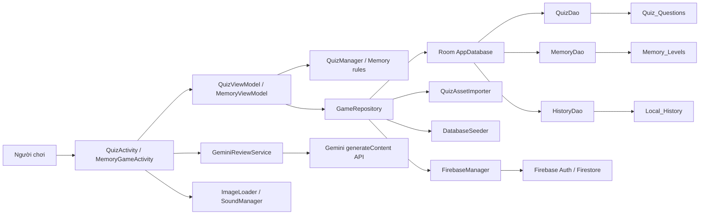
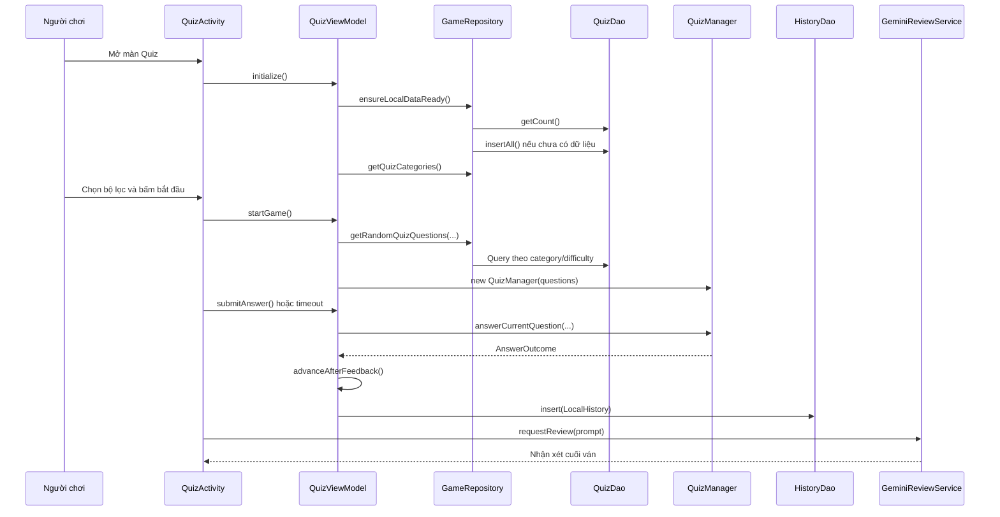
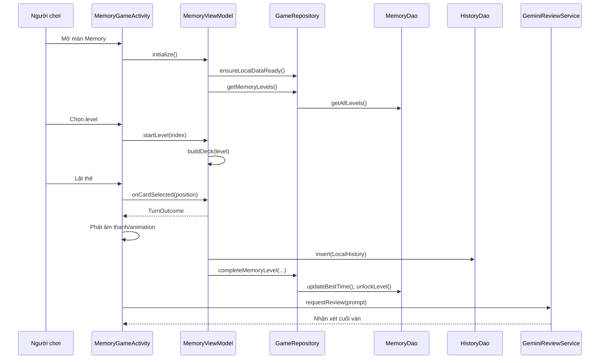

# Báo cáo kỹ thuật cá nhân - Module Game Quiz & Memory

## 1. Thông tin chung

### 1.1. Tên chức năng

Module được thực hiện gồm hai trò chơi trong ứng dụng GameHub:

- Game Quiz: trò chơi trả lời câu hỏi trắc nghiệm theo chủ đề, độ khó và giới hạn thời gian.
- Game Memory: trò chơi ghi nhớ vị trí thẻ, lật và ghép các cặp giống nhau theo từng level.

### 1.2. Phạm vi cá nhân thực hiện

Phạm vi cá nhân chỉ tập trung vào các phần liên quan trực tiếp đến Quiz và Memory:

- Xây dựng màn hình giao diện Game Quiz và Game Memory.
- Xây dựng dữ liệu cục bộ cho Quiz và Memory bằng SQLite/Room.
- Thiết kế trải nghiệm chơi game, trạng thái thắng/thua, hiệu ứng chuyển trạng thái và animation.
- Lưu lịch sử kết quả chơi cục bộ, hỗ trợ đồng bộ Firebase.
- Tích hợp nhận xét AI cho kết quả chơi cuối ván.

Các module không thuộc phạm vi chính như đăng nhập, hồ sơ, bạn bè, chat, leaderboard tổng thể và Sudoku chỉ được nhắc đến khi có kết nối kỹ thuật với phần Quiz/Memory.

### 1.3. Mục tiêu kỹ thuật

1. Người chơi có thể chơi Quiz và Memory khi không có mạng nhờ dữ liệu Room/SQLite cục bộ.
2. Giao diện game phản hồi theo thời gian thực: timer, điểm, combo, trạng thái đáp án, trạng thái thẻ.
3. Kết quả chơi được lưu vào lịch sử local trước, sau đó đồng bộ Firebase khi đủ điều kiện.
4. Nhận xét AI cuối ván phải dựa trên thống kê thật và nhật ký thao tác của người chơi.
5. Code được tách lớp rõ ràng: Activity chỉ render UI, ViewModel giữ trạng thái, Repository xử lý dữ liệu, DAO truy vấn Room.

## 2. Danh sách chức năng được phân công

### 2.1. Chức năng Game Quiz

#### 2.1.1. Màn hình thiết lập ván chơi

Người chơi có thể thiết lập:

- Chủ đề câu hỏi: chọn một hoặc nhiều category từ dữ liệu Room.
- Độ khó: tất cả, dễ, trung bình, khó.
- Số câu hỏi: 10, 15, 20, 25 hoặc 30 câu.

Màn hình này lấy dữ liệu category từ `QuizViewModel`, dữ liệu này được nạp từ `GameRepository.getQuizCategories()`.

#### 2.1.2. Màn hình chơi Quiz

Màn hình chơi hiển thị:

- Nội dung câu hỏi.
- Hình minh họa nếu câu hỏi có `link_image`.
- Bốn đáp án A/B/C/D.
- Bộ đếm thời gian mỗi câu.
- Tiến độ câu hiện tại trên tổng số câu.
- Điểm hiện tại.
- Combo hiện tại.
- Feedback đúng/sai/hết giờ sau mỗi câu.

#### 2.1.3. Luật chơi Quiz

Luật chơi được xử lý trong `QuizManager`:

- Mỗi câu có giới hạn thời gian `15_000 ms`.
- Trả lời đúng được cộng điểm.
- Trả lời đúng liên tiếp tăng combo.
- Trả lời sai hoặc hết giờ reset combo.
- Điểm gồm điểm nền, điểm thưởng độ khó, điểm thưởng thời gian còn lại và điểm thưởng combo.
- Thắng khi tỷ lệ đúng đạt từ `60%` trở lên.

#### 2.1.4. Kết quả và lịch sử Quiz

Sau khi hết câu hỏi:

- Hiển thị số câu đúng/tổng câu.
- Hiển thị thời gian chơi.
- Hiển thị tỷ lệ chính xác.
- Hiển thị điểm đạt được.
- Hiển thị kết quả tốt nhất trước đó.
- Lưu lịch sử vào `Local_History` với `game_name = "quiz"`.
- Tạo prompt và gọi AI nhận xét kết quả.

### 2.2. Chức năng Game Memory

#### 2.2.1. Màn hình chọn level

Người chơi có thể:

- Xem danh sách level Memory.
- Xem level đã mở khóa hoặc bị khóa.
- Xem kích thước lưới của từng level.
- Xem best time nếu level đã có thành tích.
- Chọn level đã mở khóa để bắt đầu chơi.

Level được lưu trong bảng `Memory_Levels`.

#### 2.2.2. Màn hình chơi Memory

Màn hình chơi hiển thị:

- Lưới thẻ theo số hàng/cột của level.
- Thời gian còn lại.
- Số lượt đoán cặp.
- Chuỗi ghép đúng tốt nhất.
- Animation lật thẻ.
- Âm thanh khi lật thẻ, ghép đúng, ghép sai, thắng hoặc thua.

#### 2.2.3. Luật chơi Memory

Luật chơi được xử lý trong `MemoryViewModel`:

- Một level gồm nhiều cặp thẻ.
- Mỗi cặp có cùng `identifier`.
- Lượt lật đầu tiên chỉ mở thẻ.
- Lượt lật thứ hai tăng số lần đoán.
- Nếu hai thẻ cùng `identifier`, cặp được đánh dấu `matched`.
- Nếu hai thẻ khác nhau, board bị khóa tạm thời, sau đó úp lại hai thẻ.
- Khi ghép hết toàn bộ cặp trước khi hết giờ, người chơi thắng.
- Khi hết giờ trước khi ghép hết cặp, người chơi thua.

#### 2.2.4. Kết quả và mở khóa level

Sau khi kết thúc level:

- Hiển thị điểm.
- Hiển thị số cặp đã ghép.
- Hiển thị số lượt đoán.
- Hiển thị thời gian chơi.
- Hiển thị tỷ lệ chính xác.
- Hiển thị chuỗi ghép đúng tốt nhất.
- Lưu lịch sử vào `Local_History` với `game_name = "memory"`.
- Nếu thắng, cập nhật best time.
- Nếu thắng, mở khóa level tiếp theo.
- Tạo prompt và gọi AI nhận xét kết quả.

### 2.3. Chức năng CSDL cục bộ

#### 2.3.1. Dữ liệu Quiz

Quiz sử dụng file SQLite asset:

`app/src/main/assets/databases/quiz_questions_500_vi_entity_images.db`

Khi ứng dụng cần dữ liệu Quiz:

1. `GameRepository.ensureLocalDataReady()` kiểm tra bảng `Quiz_Questions`.
2. Nếu bảng trống, `QuizAssetImporter.readQuestions(...)` copy asset DB vào cache.
3. Importer đọc bảng `Quiz_Questions` từ asset DB.
4. Danh sách `QuizQuestion` được insert vào Room bằng `QuizDao.insertAll(...)`.

#### 2.3.2. Dữ liệu Memory

Memory không dùng file asset riêng. Danh sách level được sinh tự động trong `DatabaseSeeder`:

- Tạo 30 level.
- Mỗi level có số hàng, số cột, số cặp và thời gian giới hạn.
- Level 1 được mở khóa mặc định.
- Các level sau được mở dần sau khi người chơi thắng level trước.

#### 2.3.3. Dữ liệu lịch sử

Quiz và Memory dùng chung bảng `Local_History` để lưu:

- Tên game.
- Trạng thái thắng/thua.
- Điểm.
- Thời gian chơi.
- Ngày chơi.
- Trạng thái đồng bộ Firebase.
- Thông tin chi tiết như level Memory.
- Số lượt đoán với Memory.

### 2.4. Chức năng nhận xét AI

Nhận xét AI được tích hợp ở màn hình kết quả:

- Quiz gọi `QuizActivity.ensureQuizAiReview()`.
- Memory gọi `MemoryGameActivity.ensureMemoryAiReview()`.
- Cả hai tạo prompt gồm thống kê cuối ván và log thao tác.
- `GeminiReviewService` gửi prompt đến Gemini API.
- Nếu Gemini lỗi hoặc trả nội dung không phù hợp, service dùng `AI_METRICS` để tạo nhận xét local.

## 3. Kiến trúc chi tiết hệ thống

### 3.1. Kiến trúc theo tầng

Module Quiz & Memory được chia thành các tầng sau:

| Tầng | Thành phần | Trách nhiệm |
|---|---|---|
| UI | `QuizActivity`, `MemoryGameActivity`, XML layout | Hiển thị màn hình, nhận thao tác, gọi ViewModel, chạy animation |
| State/Logic | `QuizViewModel`, `MemoryViewModel`, `QuizManager` | Quản lý trạng thái ván chơi, luật chơi, điểm, timer |
| Data Repository | `GameRepository` | Điều phối Room, seed data, lịch sử, đồng bộ Firebase |
| Local Database | `AppDatabase`, DAO, Entity | Lưu câu hỏi, level, lịch sử local |
| External Service | `FirebaseManager`, `GeminiReviewService`, `ImageLoader` | Đồng bộ Firestore, gọi Gemini API, tải ảnh câu hỏi |
| Utility | `SoundManager`, `PreferenceManager` | Âm thanh, cấu hình animation, cache thông tin người chơi |

### 3.2. Sơ đồ tổng quan



### 3.3. Mô hình MVVM áp dụng trong module

#### Activity

Activity chỉ chịu trách nhiệm:

- Gắn view từ XML.
- Gắn listener cho button, card, pause, retry.
- Render trạng thái từ ViewModel.
- Chạy animation và âm thanh.
- Gọi AI review khi màn kết quả xuất hiện.

Activity không trực tiếp:

- Tính điểm.
- Quyết định đúng/sai.
- Truy vấn Room.
- Ghi Firebase.
- Mở khóa level.

#### ViewModel

ViewModel chịu trách nhiệm:

- Giữ toàn bộ trạng thái của ván chơi.
- Gọi repository để lấy dữ liệu.
- Gọi manager hoặc tự xử lý luật game.
- Tính trạng thái thắng/thua.
- Tạo lịch sử sau khi kết thúc ván.
- Tạo prompt AI từ số liệu thật.

#### Repository

Repository là lớp trung gian để:

- Truy cập Room DAO.
- Import dữ liệu Quiz từ SQLite asset.
- Lấy level Memory.
- Lưu lịch sử local.
- Kích hoạt đồng bộ Firebase.
- Cung cấp thông tin người chơi hiện tại cho Memory best record.

### 3.4. Luồng dữ liệu Quiz chi tiết



### 3.5. Luồng dữ liệu Memory chi tiết



## 4. Thiết kế giao diện và trải nghiệm người dùng

### 4.1. Giao diện Quiz

#### 4.1.1. Setup screen

File liên quan:

- `game_quiz.xml`
- `view_quiz_setup.xml`
- `QuizActivity.renderSetup()`

Mục tiêu:

- Cho phép người chơi cấu hình ván chơi nhanh.
- Không cho bắt đầu khi dữ liệu chưa load xong.
- Hiển thị tóm tắt lựa chọn hiện tại.

Các trạng thái chính:

| Trạng thái | Cách xử lý |
---|---|
| Đang tải câu hỏi | Hiển thị text chờ, disable nút bắt đầu |
| Có category | Cho phép chọn chủ đề bằng bottom sheet |
| Không có dữ liệu phù hợp | Khi bắt đầu, ViewModel chuyển sang empty state |

#### 4.1.2. Gameplay screen

File liên quan:

- `view_quiz_gameplay.xml`
- `QuizActivity.renderGameplay()`
- `QuizActivity.renderAnswerButtons(...)`
- `QuizActivity.renderIllustration(...)`

Các thành phần chính:

- `quiz_question`: nội dung câu hỏi.
- `quiz_image`: ảnh minh họa tải từ URL.
- `quiz_option_a/b/c/d`: bốn đáp án.
- `quiz_timer`: thời gian còn lại.
- `quiz_live_score`: điểm đang có.
- `quiz_live_combo`: combo đang có.
- `quiz_feedback`: phản hồi sau khi trả lời.

Trạng thái đáp án:

| Trạng thái | Drawable |
|---|---|
| Mặc định | `bg_quiz_option_default.xml` |
| Đang chọn | `bg_quiz_option_selected.xml` |
| Đáp án đúng | `bg_quiz_option_correct.xml` |
| Đáp án sai | `bg_quiz_option_wrong.xml` |

#### 4.1.3. Pause và result screen

Pause:

- Dừng timer.
- Hiển thị overlay.
- Cho phép tiếp tục hoặc thoát.

Result:

- Hiển thị tổng câu đúng.
- Hiển thị thời gian.
- Hiển thị độ chính xác.
- Hiển thị điểm.
- Hiển thị best history.
- Hiển thị nhận xét AI.

### 4.2. Giao diện Memory

#### 4.2.1. Level setup screen

File liên quan:

- `game_memory.xml`
- `view_memory_setup.xml`
- `MemoryGameActivity.buildLevelGrid(...)`
- `MemoryGameActivity.createLevelTile(...)`

Level tile hiển thị:

- Tên level.
- Trạng thái khóa/mở khóa.
- Best time nếu có.
- Avatar và tên người chơi hiện tại nếu có record.

#### 4.2.2. Gameplay board

File liên quan:

- `view_memory_gameplay.xml`
- `item_memory_card.xml`
- `MemoryBoardAdapter`

Board dùng `RecyclerView` với `GridLayoutManager`.

Số cột lấy từ `MemoryLevel.columnCount`. Adapter tự tính kích thước thẻ để board vẫn hiển thị hợp lý trên nhiều kích thước màn hình.

#### 4.2.3. Animation Memory

Animation lật thẻ được thực hiện trong `MemoryBoardAdapter.animateFlip(...)`:

1. Xoay thẻ đến 90 độ theo trục Y.
2. Đổi mặt thẻ ở giữa animation.
3. Xoay tiếp về 0 độ.

Mismatch:

- Khi hai thẻ không khớp, `MemoryViewModel` khóa board.
- `MemoryGameActivity` chờ `MISMATCH_DELAY_MS`.
- Sau đó gọi `resolveMismatch()` để úp lại thẻ.

## 5. Thiết kế cơ sở dữ liệu

### 5.1. Room Database

File: `app/src/main/java/com/example/gamehub/data/local/AppDatabase.java`

Database name: `gamehub.db`

Version hiện tại: `6`

Các bảng liên quan trực tiếp đến nhiệm vụ:

- `Quiz_Questions`
- `Memory_Levels`
- `Local_History`

### 5.2. Bảng `Quiz_Questions`

Entity: `QuizQuestion`

DAO: `QuizDao`

Mục đích:

- Lưu câu hỏi trắc nghiệm.
- Hỗ trợ lọc theo chủ đề và độ khó.
- Hỗ trợ lấy câu hỏi ngẫu nhiên cho mỗi ván.

| Cột | Kiểu Java | Mô tả |
|---|---|---|
| `id` | `int` | Khóa chính câu hỏi |
| `category` | `String` | Chủ đề câu hỏi |
| `question` | `String` | Nội dung câu hỏi |
| `link_image` | `String` | URL ảnh minh họa |
| `opt_a` | `String` | Đáp án A |
| `opt_b` | `String` | Đáp án B |
| `opt_c` | `String` | Đáp án C |
| `opt_d` | `String` | Đáp án D |
| `correct_ans` | `String` | Đáp án đúng |
| `difficulty` | `String` | Độ khó |

Các query chính:

- `getDistinctCategories()`: lấy danh sách chủ đề.
- `getRandomQuestions(limit)`: lấy câu hỏi ngẫu nhiên không lọc.
- `getRandomQuestionsByDifficulty(...)`: lọc theo độ khó.
- `getRandomQuestionsByCategories(...)`: lọc theo chủ đề.
- `getRandomQuestionsByCategoriesAndDifficulty(...)`: lọc đồng thời chủ đề và độ khó.

### 5.3. Bảng `Memory_Levels`

Entity: `MemoryLevel`

DAO: `MemoryDao`

Mục đích:

- Lưu cấu hình level.
- Lưu trạng thái mở khóa.
- Lưu best time cục bộ.

| Cột | Kiểu Java | Mô tả |
|---|---|---|
| `level_id` | `int` | Số level và khóa chính |
| `row_count` | `int` | Số hàng |
| `column_count` | `int` | Số cột |
| `time_limit_sec` | `long` | Thời gian giới hạn |
| `best_time_ms` | `long` | Thời gian tốt nhất |
| `is_unlocked` | `boolean` | Level đã mở khóa hay chưa |

Các query chính:

- `getAllLevels()`: lấy danh sách level để hiển thị.
- `getLevel(levelId)`: lấy một level cụ thể.
- `updateBestTime(...)`: cập nhật best time.
- `unlockLevel(...)`: mở khóa level tiếp theo.
- `clearAll()` và `insertAll(...)`: phục vụ seed lại danh sách level.

### 5.4. Bảng `Local_History`

Entity: `LocalHistory`

DAO: `HistoryDao`

Mục đích:

- Lưu kết quả từng ván.
- Tạo dữ liệu thống kê local.
- Là hàng đợi đồng bộ Firebase.

| Cột | Kiểu Java | Mô tả |
|---|---|---|
| `id` | `int` | Khóa chính tự tăng |
| `game_name` | `String` | `quiz` hoặc `memory` |
| `status` | `String` | `won`, `lost`, `completed` |
| `score` | `int` | Điểm cuối ván |
| `time_spent` | `long` | Thời gian chơi |
| `play_date` | `long` | Timestamp khi chơi |
| `is_synced` | `boolean` | Đã đồng bộ Firebase hay chưa |
| `detail` | `String` | Chi tiết bổ sung, ví dụ Memory level |
| `attempt_count` | `int` | Số lượt đoán của Memory |

Các query chính:

- `insert(...)`: lưu một ván chơi.
- `getAllNewestFirst()`: lấy lịch sử mới nhất trước.
- `getUnsyncedHistory()`: lấy các bản ghi chưa đồng bộ.
- `markSynced(...)`: đánh dấu đã đồng bộ.
- `getBestRecordForGame(...)`: lấy record tốt nhất cho result screen.

## 6. Phân tích code đáp ứng chức năng

### 6.1. Game Quiz

#### 6.1.1. `QuizActivity`

Vai trò:

- Là controller giao diện cho Quiz.
- Không chứa luật tính điểm.
- Không truy vấn Room trực tiếp.
- Nhận dữ liệu từ `QuizViewModel` và render ra UI.

Các hàm quan trọng:

| Hàm | Vai trò chi tiết |
|---|---|
| `onCreate(...)` | Khởi tạo layout, ViewModel, SoundManager, GeminiReviewService |
| `bindViews()` | Ánh xạ view cho setup, gameplay, result, pause |
| `bindActions()` | Gắn sự kiện chọn chủ đề, độ khó, số câu, đáp án, pause, retry |
| `installBackHandler()` | Xử lý nút back theo trạng thái game |
| `render()` | Render đồng bộ toàn bộ màn hình theo state hiện tại |
| `renderSetup()` | Cập nhật lựa chọn chủ đề, độ khó, số câu |
| `renderGameplay()` | Cập nhật câu hỏi, timer, đáp án, điểm, combo, ảnh |
| `renderResult()` | Cập nhật thống kê cuối ván và nhận xét AI |
| `renderIllustration(...)` | Tải ảnh câu hỏi bằng `ImageLoader` |
| `renderAnswerButtons(...)` | Tô trạng thái đáp án sau khi chọn hoặc trả lời |
| `handleOutcome(...)` | Phát âm thanh đúng/sai và chờ trước khi sang câu |
| `ensureQuizAiReview()` | Chống gọi Gemini lặp lại cho cùng một kết quả |

#### 6.1.2. `QuizViewModel`

Vai trò:

- Giữ state của ván Quiz.
- Tải dữ liệu câu hỏi từ repository.
- Điều khiển timer từng câu.
- Gửi lựa chọn cho `QuizManager`.
- Lưu lịch sử cuối ván.
- Tạo prompt AI.

Các state quan trọng:

| Biến | Ý nghĩa |
|---|---|
| `currentScreen` | SETUP, GAMEPLAY hoặc RESULT |
| `selectedCategories` | Danh sách chủ đề được chọn |
| `selectedDifficulty` | Độ khó đang chọn |
| `selectedQuestionCount` | Số câu hỏi mỗi ván |
| `remainingQuestionMs` | Thời gian còn lại của câu hiện tại |
| `elapsedSessionMs` | Tổng thời gian đã chơi |
| `selectedAnswerKey` | Đáp án người chơi chọn |
| `latestOutcome` | Kết quả trả lời gần nhất |
| `sessionLog` | Nhật ký thao tác dùng cho AI |

Các hàm quan trọng:

| Hàm | Vai trò chi tiết |
|---|---|
| `initialize()` | Đảm bảo dữ liệu local sẵn sàng và lấy category |
| `startGame()` | Lấy danh sách câu hỏi theo bộ lọc và tạo `QuizManager` |
| `tickQuestion()` | Giảm timer và phát hiện timeout |
| `selectAnswer(...)` | Lưu đáp án đang chọn |
| `submitAnswer()` | Khóa đáp án và lấy kết quả từ `QuizManager` |
| `timeoutCurrentQuestion()` | Xử lý hết giờ |
| `advanceAfterFeedback()` | Sang câu tiếp theo hoặc kết thúc ván |
| `finishGame()` | Tạo `LocalHistory`, lưu DB, kích hoạt sync |
| `buildAiReviewPrompt()` | Tạo prompt AI từ thống kê và log |

#### 6.1.3. `QuizManager`

Vai trò:

- Là engine luật chơi độc lập với Android UI.
- Nhận danh sách `QuizQuestion`.
- Tính đúng/sai, điểm, combo, win condition.

Công thức điểm:

```text
điểm = 100 + bonus_độ_khó + bonus_thời_gian + bonus_combo
```

Trong đó:

- `bonus_độ_khó = 0` với easy.
- `bonus_độ_khó = 35` với medium.
- `bonus_độ_khó = 60` với hard.
- `bonus_thời_gian = số_giây_còn_lại * 8`.
- `bonus_combo = (combo - 1) * 20`.

Điều kiện thắng:

```text
tỷ lệ đúng >= 60%
```

### 6.2. Game Memory

#### 6.2.1. `MemoryGameActivity`

Vai trò:

- Là controller giao diện cho Memory.
- Render level grid, board, pause, result.
- Chạy animation và âm thanh.
- Ghi log thao tác để đưa vào prompt AI.

Các hàm quan trọng:

| Hàm | Vai trò chi tiết |
|---|---|
| `onCreate(...)` | Khởi tạo layout, adapter, ViewModel, SoundManager, AI service |
| `bindViews()` | Ánh xạ view cho setup, gameplay, result, pause |
| `bindActions()` | Gắn sự kiện pause, resume, retry, next level |
| `renderSetup()` | Hiển thị danh sách level |
| `buildLevelGrid(...)` | Tạo các tile level bằng code |
| `createLevelTile(...)` | Tạo UI cho một level |
| `renderGameplay()` | Render board, timer, lượt đoán, streak |
| `onCardClicked(...)` | Gửi lượt click cho ViewModel và xử lý âm thanh/animation |
| `scheduleTimerTick()` | Chạy timer mỗi giây |
| `renderResult()` | Hiển thị kết quả và gọi nhận xét AI |
| `ensureMemoryAiReview()` | Chống gọi Gemini lặp cho cùng kết quả |

#### 6.2.2. `MemoryViewModel`

Vai trò:

- Quản lý toàn bộ state Memory.
- Tải level từ Room.
- Sinh deck thẻ.
- Xử lý luật match/mismatch/win/lose.
- Lưu lịch sử và mở khóa level.

Các state quan trọng:

| Biến | Ý nghĩa |
|---|---|
| `levels` | Danh sách level từ Room |
| `cards` | Danh sách thẻ của level hiện tại |
| `firstSelectedPosition` | Vị trí thẻ đầu tiên đang mở |
| `secondSelectedPosition` | Vị trí thẻ thứ hai đang mở |
| `matchedPairs` | Số cặp đã ghép đúng |
| `pairAttempts` | Số lượt đoán cặp |
| `currentStreak` | Chuỗi ghép đúng hiện tại |
| `bestStreak` | Chuỗi ghép đúng tốt nhất |
| `remainingTimeMs` | Thời gian còn lại |
| `boardLocked` | Board đang khóa khi mismatch |

Các hàm quan trọng:

| Hàm | Vai trò chi tiết |
|---|---|
| `initialize()` | Tải danh sách level từ Room |
| `startLevel(...)` | Reset state và tạo deck mới |
| `tick()` | Giảm thời gian, xử lý thua khi hết giờ |
| `onCardSelected(...)` | Xử lý một lượt lật thẻ |
| `resolveMismatch()` | Úp lại cặp thẻ không khớp |
| `finishGame(...)` | Lưu lịch sử, cập nhật best time và unlock level |
| `buildDeck(...)` | Tạo danh sách `MemoryCard` từ cấu hình level |
| `buildSmartArrangement(...)` | Xáo thẻ nhiều lần để giảm cặp giống nhau nằm cạnh nhau |

#### 6.2.3. `MemoryBoardAdapter`

Vai trò:

- Render danh sách `MemoryCard` lên `RecyclerView`.
- Tự tính kích thước thẻ theo số cột.
- Tô màu mặt trước của thẻ.
- Chạy animation lật thẻ.

Adapter không quyết định:

- Thẻ nào đúng/sai.
- Khi nào thắng/thua.
- Điểm của người chơi.

Những việc đó thuộc `MemoryViewModel`.

### 6.3. Ma trận code đáp ứng chức năng được phân công

Phần này bổ sung theo yêu cầu: **"Code đáp ứng chức năng (Lớp, hàm, Bảng trong CSDL, API gọi ngoài), cần liệt kê và có giải thích đầy đủ"**. Nội dung bên dưới liệt kê rõ lớp, hàm, bảng CSDL, API ngoài và trích các đoạn code liên quan trực tiếp từ source.

#### 6.3.1. Nhóm code Game Quiz

| Lớp/File | Hàm/Thành phần | Chức năng đáp ứng | Giải thích |
|---|---|---|---|
| `QuizActivity.java` | `onCreate(...)` | Khởi tạo màn Quiz | Gắn layout, tạo `QuizViewModel`, `SoundManager`, `GeminiReviewService`, observer và timer |
| `QuizActivity.java` | `renderSetup()` | Màn thiết lập ván Quiz | Render lựa chọn chủ đề, độ khó, số câu và trạng thái loading |
| `QuizActivity.java` | `renderGameplay()` | Màn chơi Quiz | Render câu hỏi, ảnh, đáp án, timer, điểm, combo và feedback |
| `QuizActivity.java` | `renderAnswerButtons(...)` | Hiệu ứng đúng/sai | Đổi background đáp án theo trạng thái mặc định, đang chọn, đúng, sai |
| `QuizActivity.java` | `ensureQuizAiReview()` | Gọi AI nhận xét Quiz | Gọi `GeminiReviewService` một lần cho mỗi kết quả, tránh gọi trùng khi UI render lại |
| `QuizViewModel.java` | `initialize()` | Chuẩn bị dữ liệu Quiz | Gọi repository để import câu hỏi local nếu Room chưa có dữ liệu, sau đó lấy category |
| `QuizViewModel.java` | `startGame()` | Bắt đầu ván Quiz | Lấy câu hỏi ngẫu nhiên theo category/difficulty/question count và tạo `QuizManager` |
| `QuizViewModel.java` | `tickQuestion()` | Timer câu hỏi | Giảm thời gian còn lại từng giây và báo timeout |
| `QuizViewModel.java` | `submitAnswer()` | Gửi đáp án | Khóa đáp án và gọi `QuizManager.answerCurrentQuestion(...)` để tính kết quả |
| `QuizViewModel.java` | `timeoutCurrentQuestion()` | Hết giờ | Xử lý như một lượt trả lời sai do không chọn đáp án |
| `QuizViewModel.java` | `advanceAfterFeedback()` | Chuyển câu/kết thúc ván | Sang câu tiếp theo sau feedback hoặc gọi `finishGame()` |
| `QuizViewModel.java` | `finishGame()` | Lưu kết quả Quiz | Tạo `LocalHistory(game_name = "quiz")`, lưu Room và kích hoạt sync |
| `QuizViewModel.java` | `buildAiReviewPrompt()` | Tạo prompt AI | Gom thống kê và log thao tác thành prompt cho Gemini |
| `QuizManager.java` | `answerCurrentQuestion(...)` | Luật trả lời Quiz | Kiểm tra đúng/sai, timeout, cập nhật combo, điểm, số câu đúng |
| `QuizManager.java` | `calculateScore(...)` | Công thức điểm Quiz | Tính điểm nền, bonus độ khó, bonus thời gian và bonus combo |
| `QuizManager.java` | `isWin()` | Điều kiện thắng Quiz | Thắng khi tỷ lệ đúng đạt từ `WIN_THRESHOLD_PERCENT = 60` |

#### 6.3.2. Nhóm code Game Memory

| Lớp/File | Hàm/Thành phần | Chức năng đáp ứng | Giải thích |
|---|---|---|---|
| `MemoryGameActivity.java` | `onCreate(...)` | Khởi tạo màn Memory | Gắn layout, tạo adapter, ViewModel, âm thanh và AI service |
| `MemoryGameActivity.java` | `renderSetup()` | Màn chọn level | Hiển thị danh sách level đã khóa/mở khóa và best time |
| `MemoryGameActivity.java` | `buildLevelGrid(...)` | Tạo lưới level | Sinh các tile level bằng code theo danh sách `MemoryLevel` |
| `MemoryGameActivity.java` | `renderGameplay()` | Màn chơi Memory | Render board, timer, lượt đoán, streak và điểm |
| `MemoryGameActivity.java` | `onCardClicked(...)` | Xử lý click thẻ | Gửi vị trí thẻ cho `MemoryViewModel.onCardSelected(...)`, phát âm thanh và chạy animation |
| `MemoryGameActivity.java` | `renderResult()` | Màn kết quả Memory | Hiển thị thắng/thua, điểm, cặp đúng, lượt đoán, accuracy, streak và nhận xét AI |
| `MemoryGameActivity.java` | `ensureMemoryAiReview()` | Gọi AI nhận xét Memory | Gọi Gemini một lần theo khóa kết quả gồm level, điểm, cặp đúng, lượt đoán, thời gian |
| `MemoryGameActivity.java` | `buildMemoryReviewPrompt()` | Tạo prompt Memory | Gom thống kê ván Memory, log thao tác và `AI_METRICS` |
| `MemoryViewModel.java` | `initialize()` | Chuẩn bị dữ liệu Memory | Gọi repository để seed dữ liệu local và lấy danh sách level từ Room |
| `MemoryViewModel.java` | `startLevel(...)` | Bắt đầu level | Reset state, set timer và gọi `buildDeck(...)` |
| `MemoryViewModel.java` | `tick()` | Timer Memory | Giảm thời gian, xử lý thua khi hết giờ |
| `MemoryViewModel.java` | `onCardSelected(...)` | Luật lật thẻ | Xử lý lần lật đầu, lần lật thứ hai, match, mismatch, win |
| `MemoryViewModel.java` | `resolveMismatch()` | Úp lại thẻ sai | Sau delay, úp lại hai thẻ không khớp và mở khóa board |
| `MemoryViewModel.java` | `finishGame(...)` | Kết thúc Memory | Lưu lịch sử, cập nhật best time, mở khóa level tiếp theo |
| `MemoryViewModel.java` | `buildDeck(...)` | Sinh bộ thẻ | Tạo danh sách `MemoryCard` từ số cặp của level |
| `MemoryViewModel.java` | `buildSmartArrangement(...)` | Xáo thẻ thông minh | Giảm trường hợp hai thẻ giống nhau nằm cạnh nhau ngay từ đầu |
| `MemoryBoardAdapter.java` | `onBindViewHolder(...)` | Render từng thẻ | Hiển thị mặt trước/mặt sau và kích thước thẻ |
| `MemoryBoardAdapter.java` | `animateFlip(...)` | Animation lật thẻ | Xoay thẻ theo trục Y, đổi mặt ở giữa animation |
| `MemoryCard.java` | Model runtime | Trạng thái thẻ | Lưu id, identifier, label, màu, trạng thái revealed/matched |

#### 6.3.3. Nhóm code CSDL Room/SQLite

| Lớp/File | Thành phần | Chức năng đáp ứng | Giải thích |
|---|---|---|---|
| `AppDatabase.java` | `@Database(...)` | Khai báo Room database | Đăng ký entity `QuizQuestion`, `MemoryLevel`, `LocalHistory` và DAO |
| `QuizQuestion.java` | `@Entity(tableName = "Quiz_Questions")` | Bảng câu hỏi Quiz | Lưu câu hỏi, đáp án, ảnh, đáp án đúng, category, difficulty |
| `MemoryLevel.java` | `@Entity(tableName = "Memory_Levels")` | Bảng level Memory | Lưu cấu hình board, thời gian, best time, trạng thái mở khóa |
| `LocalHistory.java` | `@Entity(tableName = "Local_History")` | Bảng lịch sử chơi | Lưu kết quả Quiz/Memory local và trạng thái sync Firebase |
| `QuizDao.java` | Query Quiz | Lấy category, random question, lọc category/difficulty |
| `MemoryDao.java` | Query Memory | Lấy level, update best time, unlock level |
| `HistoryDao.java` | Query lịch sử | Insert lịch sử, lấy best record, lấy bản ghi chưa sync, đánh dấu synced |
| `QuizAssetImporter.java` | `readQuestions(...)` | Import SQLite asset | Copy file DB câu hỏi từ `assets/databases` vào cache, đọc bảng `Quiz_Questions` |
| `DatabaseSeeder.java` | `buildMemoryLevels()` | Seed level Memory | Sinh 30 level offline cho Memory |
| `GameRepository.java` | `ensureLocalDataReady()` | Chuẩn bị dữ liệu local | Import Quiz asset và đảm bảo Memory level đã seed |

#### 6.3.4. Nhóm API gọi ngoài

| API/Service | File gọi | Hàm gọi | Chức năng | Giải thích |
|---|---|---|---|---|
| Gemini generateContent API | `GeminiReviewService.java` | `requestReview(...)`, `performRequestBody(...)` | Sinh nhận xét AI cuối ván | Gửi prompt Quiz/Memory lên Gemini, nhận 2-3 câu nhận xét tiếng Việt |
| Firebase Auth | `GameRepository.java`, `FirebaseManager.java` | `FirebaseAuth.getInstance()` | Xác định user hiện tại | Dùng `uid` hiện tại để sync lịch sử vào đúng người chơi |
| Firebase Firestore | `FirebaseManager.java` | `syncHistoryRecordDetailed(...)` | Đồng bộ kết quả chơi | Ghi `Game_Records`, cập nhật tổng điểm trong `Users` bằng transaction |
| WorkManager | `GameRepository.java` | `triggerHistorySyncIfNeeded()` | Hẹn đồng bộ nền | Khi offline hoặc chưa sync được, lịch sử local được giữ lại và sync sau |
| HTTP ảnh câu hỏi | `ImageLoader.java` | `load(...)` | Tải ảnh minh họa Quiz | Tải ảnh URL trên background thread, cache bằng `LruCache`, trả kết quả về main thread |

### 6.4. Trích đoạn code lớp và hàm đáp ứng chức năng

Các đoạn code dưới đây được rút từ source chính của module. Một số đoạn được rút gọn bằng `...` để tập trung vào phần xử lý cốt lõi, nhưng vẫn giữ nguyên logic quan trọng.

#### 6.4.1. `QuizManager` - kiểm tra đáp án, tính điểm, combo, điều kiện thắng

File: `app/src/main/java/com/example/gamehub/games/quiz/QuizManager.java`

```java
public class QuizManager {
    public static final int WIN_THRESHOLD_PERCENT = 60;

    public AnswerOutcome answerCurrentQuestion(String optionKey, long remainingQuestionMs, boolean timedOut) {
        QuizQuestion question = getCurrentQuestion();
        if (question == null) {
            return null;
        }

        String normalizedSelectedKey = optionKey == null ? "" : optionKey.trim().toUpperCase(Locale.getDefault());
        String correctAnswerKey = question.correctAnswer == null ? "" : question.correctAnswer.trim().toUpperCase(Locale.getDefault());
        boolean isCorrect = !timedOut && correctAnswerKey.equals(normalizedSelectedKey);

        int awardedScore = 0;
        if (isCorrect) {
            correctCount++;
            combo++;
            bestCombo = Math.max(bestCombo, combo);
            awardedScore = calculateScore(question.difficulty, remainingQuestionMs, combo);
            score += awardedScore;
        } else {
            combo = 0;
        }
        answeredCount++;

        return new AnswerOutcome(
                question,
                normalizedSelectedKey,
                correctAnswerKey,
                isCorrect,
                timedOut,
                awardedScore,
                score,
                combo,
                correctCount,
                answeredCount,
                currentIndex < questions.size() - 1
        );
    }

    private int calculateScore(String difficulty, long remainingQuestionMs, int combo) {
        int baseScore = 100;
        int difficultyBonus = 0;
        if ("medium".equalsIgnoreCase(difficulty)) {
            difficultyBonus = 35;
        } else if ("hard".equalsIgnoreCase(difficulty)) {
            difficultyBonus = 60;
        }
        int timeBonus = (int) Math.max(0L, remainingQuestionMs / 1000L) * 8;
        int comboBonus = Math.max(0, combo - 1) * 20;
        return baseScore + difficultyBonus + timeBonus + comboBonus;
    }

    public boolean isWin() {
        return getAccuracyPercent() >= WIN_THRESHOLD_PERCENT;
    }
}
```

Giải thích:

- `answerCurrentQuestion(...)` là hàm trung tâm của luật Quiz.
- `timedOut = true` làm câu trả lời tự động sai dù người chơi có chọn gì.
- Khi đúng, hệ thống tăng `correctCount`, tăng `combo`, cập nhật `bestCombo`, tính điểm và cộng vào `score`.
- Khi sai hoặc hết giờ, `combo` được reset về 0.
- `calculateScore(...)` thể hiện rõ công thức điểm: điểm nền + thưởng độ khó + thưởng thời gian + thưởng combo.
- `isWin()` gắn điều kiện thắng với tỷ lệ đúng từ 60% trở lên.

#### 6.4.2. `QuizViewModel` - lấy câu hỏi, submit đáp án, lưu lịch sử, tạo prompt AI

File: `app/src/main/java/com/example/gamehub/games/quiz/QuizViewModel.java`

```java
public void initialize() {
    if (initialized || loading) {
        notifyObservers();
        return;
    }
    loading = true;
    notifyObservers();
    executor.execute(() -> {
        try {
            repository.ensureLocalDataReady();
            List<String> categories = repository.getQuizCategories();
            mainHandler.post(() -> {
                initialized = true;
                loading = false;
                availableCategories.clear();
                availableCategories.addAll(categories);
                if (selectedCategories.isEmpty()) {
                    selectedCategories.addAll(categories);
                }
                notifyObservers();
            });
        } catch (IOException exception) {
            mainHandler.post(() -> {
                loading = false;
                message = "Không thể tải bộ câu hỏi lúc này.";
                notifyObservers();
            });
        }
    });
}
```

```java
public void startGame() {
    if (loading) {
        return;
    }
    loading = true;
    message = "";
    notifyObservers();
    executor.execute(() -> {
        List<QuizQuestion> questions = repository.getRandomQuizQuestions(
                getSelectedCategories(),
                "all".equals(selectedDifficulty) ? null : selectedDifficulty,
                selectedQuestionCount
        );
        mainHandler.post(() -> {
            loading = false;
            quizManager = new QuizManager(questions);
            currentScreen = Screen.GAMEPLAY;
            pauseVisible = false;
            emptyState = questions.isEmpty();
            answerLocked = emptyState;
            latestOutcome = null;
            selectedAnswerKey = "";
            remainingQuestionMs = QUESTION_TIME_MS;
            elapsedSessionMs = 0L;
            message = emptyState ? "Chưa có câu hỏi phù hợp với bộ lọc hiện tại." : "";
            sessionLog.clear();
            appendQuestionShownLog();
            notifyObservers();
        });
    });
}
```

```java
public QuizManager.AnswerOutcome submitAnswer() {
    if (quizManager == null || answerLocked || selectedAnswerKey.isEmpty()) {
        return null;
    }
    latestOutcome = quizManager.answerCurrentQuestion(selectedAnswerKey, remainingQuestionMs, false);
    answerLocked = true;
    if (latestOutcome != null) {
        message = latestOutcome.buildFeedbackMessage();
        appendOutcomeLog(latestOutcome);
    }
    notifyObservers();
    return latestOutcome;
}

public QuizManager.AnswerOutcome timeoutCurrentQuestion() {
    if (quizManager == null || answerLocked) {
        return null;
    }
    latestOutcome = quizManager.answerCurrentQuestion("", 0L, true);
    answerLocked = true;
    selectedAnswerKey = "";
    if (latestOutcome != null) {
        message = latestOutcome.buildFeedbackMessage();
        appendOutcomeLog(latestOutcome);
    }
    notifyObservers();
    return latestOutcome;
}
```

```java
private void finishGame() {
    currentScreen = Screen.RESULT;
    pauseVisible = false;
    answerLocked = true;
    bestHistoryText = "Đang cập nhật lịch sử...";
    notifyObservers();

    if (quizManager == null) {
        return;
    }
    LocalHistory currentHistory = new LocalHistory(
            "quiz",
            quizManager.isWin() ? "won" : "lost",
            quizManager.getScore(),
            elapsedSessionMs,
            System.currentTimeMillis(),
            false
    );

    executor.execute(() -> {
        repository.saveHistory(currentHistory, result -> {
            if (!result.success && result.message != null && !result.message.trim().isEmpty()) {
                pendingSyncToastMessage = result.message;
                notifyObservers();
            }
        });
        LocalHistory bestHistory = repository.getBestHistoryForGame("quiz");
        mainHandler.post(() -> {
            bestHistoryText = buildBestHistoryText(bestHistory);
            notifyObservers();
        });
    });
}
```

```java
public String buildAiReviewPrompt() {
    StringBuilder builder = new StringBuilder();
    builder.append("Bạn là huấn luyện viên cho game đố vui. ")
            .append("Hãy phân tích đúng theo luật chơi của Quiz trong GameHub ...\n\n")
            .append("Tóm tắt ván chơi:\n")
            .append("- Chủ đề: ").append(getSelectedCategoriesLabel()).append('\n')
            .append("- Độ khó: ").append(getSelectedDifficultyLabel()).append('\n')
            .append("- Số câu: ").append(getTotalQuestions()).append('\n')
            .append("- Đúng: ").append(getCorrectCount()).append('\n')
            .append("- Chính xác: ").append(getAccuracyPercent()).append("%\n")
            .append("- Điểm: ").append(getScore()).append('\n')
            .append("- Combo tốt nhất: ").append(getBestCombo()).append('\n')
            .append("- Thời gian: ").append(formatDuration(elapsedSessionMs)).append('\n')
            .append("- Kết quả: ").append(isWin() ? "Đạt" : "Chưa đạt").append("\n\n")
            .append("Nhật ký thao tác:\n");
    ...
    appendAiMetricsBlock(builder);
    return builder.toString();
}
```

Giải thích:

- `initialize()` đảm bảo dữ liệu local đã sẵn sàng trước khi chơi.
- `startGame()` lấy câu hỏi từ Room theo bộ lọc người chơi chọn.
- `submitAnswer()` và `timeoutCurrentQuestion()` đều gọi chung engine `QuizManager`.
- `finishGame()` lưu kết quả vào `Local_History` với `game_name = "quiz"`.
- `buildAiReviewPrompt()` tạo dữ liệu đầu vào cho AI dựa trên thống kê thật và log thao tác.

#### 6.4.3. `MemoryViewModel` - luật lật thẻ, match/mismatch, thắng/thua, mở khóa level

File: `app/src/main/java/com/example/gamehub/games/memory/MemoryViewModel.java`

```java
public void startLevel(int index) {
    if (index < 0 || index >= levels.size()) {
        return;
    }
    MemoryLevel level = levels.get(index);
    if (!level.isUnlocked) {
        return;
    }
    selectedLevelIndex = index;
    currentLevelIndex = index;
    currentScreen = Screen.GAMEPLAY;
    pauseVisible = false;
    boardLocked = false;
    lastGameWon = false;
    unlockedNextLevelThisRound = false;
    firstSelectedPosition = -1;
    secondSelectedPosition = -1;
    matchedPairs = 0;
    pairAttempts = 0;
    currentStreak = 0;
    bestStreak = 0;
    score = 0;
    elapsedTimeMs = 0L;
    remainingTimeMs = level.timeLimitSec * 1000L;
    buildDeck(level);
    notifyObservers();
}
```

```java
public TurnOutcome onCardSelected(int position) {
    if (currentScreen != Screen.GAMEPLAY || boardLocked || position < 0 || position >= cards.size()) {
        return new TurnOutcome(TurnType.NONE, -1, -1, 0);
    }

    MemoryCard tappedCard = cards.get(position);
    if (tappedCard.matched || tappedCard.revealed) {
        return new TurnOutcome(TurnType.NONE, -1, -1, 0);
    }

    tappedCard.revealed = true;
    markBoardChanged();
    if (firstSelectedPosition < 0) {
        firstSelectedPosition = position;
        notifyObservers();
        return new TurnOutcome(TurnType.FIRST_REVEAL, position, -1, 0);
    }

    secondSelectedPosition = position;
    pairAttempts++;
    MemoryCard firstCard = cards.get(firstSelectedPosition);
    MemoryCard secondCard = cards.get(secondSelectedPosition);

    if (firstCard.identifier == secondCard.identifier) {
        firstCard.matched = true;
        secondCard.matched = true;
        markBoardChanged();
        matchedPairs++;
        currentStreak++;
        bestStreak = Math.max(bestStreak, currentStreak);
        int awardedScore = 80 + (int) (remainingTimeMs / 1000L) * 3 + Math.max(0, currentStreak - 1) * 15;
        score += awardedScore;
        int resolvedFirst = firstSelectedPosition;
        int resolvedSecond = secondSelectedPosition;
        resetSelection();
        if (matchedPairs == cards.size() / 2) {
            finishGame(true);
            return new TurnOutcome(TurnType.WIN, resolvedFirst, resolvedSecond, awardedScore);
        }
        notifyObservers();
        return new TurnOutcome(TurnType.MATCH, resolvedFirst, resolvedSecond, awardedScore);
    }

    currentStreak = 0;
    boardLocked = true;
    notifyObservers();
    return new TurnOutcome(TurnType.MISMATCH, firstSelectedPosition, secondSelectedPosition, 0);
}
```

```java
public void resolveMismatch() {
    if (firstSelectedPosition < 0 || secondSelectedPosition < 0) {
        boardLocked = false;
        notifyObservers();
        return;
    }
    cards.get(firstSelectedPosition).revealed = false;
    cards.get(secondSelectedPosition).revealed = false;
    markBoardChanged();
    resetSelection();
    boardLocked = false;
    notifyObservers();
}
```

```java
private void finishGame(boolean won) {
    currentScreen = Screen.RESULT;
    pauseVisible = false;
    boardLocked = true;
    lastGameWon = won;
    unlockedNextLevelThisRound = false;

    MemoryLevel currentLevel = getCurrentLevel();
    if (currentLevel != null && won) {
        if (currentLevel.bestTimeMs == 0L || elapsedTimeMs < currentLevel.bestTimeMs) {
            currentLevel.bestTimeMs = elapsedTimeMs;
        }
        if (currentLevelIndex + 1 < levels.size() && !levels.get(currentLevelIndex + 1).isUnlocked) {
            levels.get(currentLevelIndex + 1).isUnlocked = true;
            unlockedNextLevelThisRound = true;
        }
    }
    notifyObservers();

    if (currentLevel == null) {
        return;
    }
    LocalHistory history = new LocalHistory(
            "memory",
            won ? "won" : "lost",
            score,
            elapsedTimeMs,
            System.currentTimeMillis(),
            false,
            String.format(Locale.getDefault(), "Level %d (%s)", currentLevel.levelId, currentLevel.getDisplayLabel()),
            pairAttempts
    );

    executor.execute(() -> {
        repository.saveHistory(history, result -> { ... });
        repository.completeMemoryLevel(currentLevel.levelId, elapsedTimeMs, won);
        List<MemoryLevel> refreshedLevels = repository.getMemoryLevels();
        mainHandler.post(() -> {
            levels.clear();
            levels.addAll(refreshedLevels);
            selectedLevelIndex = findHighestUnlockedLevelIndex();
            notifyObservers();
        });
    });
}
```

```java
private void buildDeck(MemoryLevel level) {
    cards.clear();
    int pairCount = level.getPairCount();
    List<Integer> bestArrangement = buildSmartArrangement(pairCount, level.rowCount, level.columnCount);
    long nextCardId = 1L;
    for (Integer identifier : bestArrangement) {
        cards.add(new MemoryCard(nextCardId++, identifier, buildLabel(identifier), identifier % 8));
    }
    markBoardChanged();
}
```

Giải thích:

- `startLevel(...)` reset toàn bộ state cho một ván mới và chỉ cho chơi level đã mở khóa.
- `onCardSelected(...)` xử lý đủ 4 trường hợp: không hợp lệ, lật thẻ đầu, ghép đúng, ghép sai.
- Khi match, hệ thống cộng điểm dựa trên điểm nền, thời gian còn lại và streak.
- Khi mismatch, board bị khóa để người chơi không click thêm trước khi hai thẻ úp lại.
- `finishGame(...)` lưu `LocalHistory(game_name = "memory")`, cập nhật best time và mở khóa level tiếp theo.
- `buildDeck(...)` tạo bộ thẻ từ cấu hình bảng `Memory_Levels`.

#### 6.4.4. `MemoryBoardAdapter` - animation lật thẻ

File: `app/src/main/java/com/example/gamehub/games/memory/MemoryBoardAdapter.java`

```java
private void applyStateImmediately(ViewHolder holder, boolean showFront) {
    holder.frontFace.setVisibility(showFront ? View.VISIBLE : View.GONE);
    holder.backFace.setVisibility(showFront ? View.GONE : View.VISIBLE);
    holder.itemView.setRotationY(0f);
    holder.itemView.setAlpha(1f);
}

private void animateFlip(ViewHolder holder, boolean showFront) {
    holder.itemView.animate()
            .rotationY(90f)
            .setDuration(110L)
            .setListener(new AnimatorListenerAdapter() {
                @Override
                public void onAnimationEnd(Animator animation) {
                    applyStateImmediately(holder, showFront);
                    holder.itemView.setRotationY(-90f);
                    holder.itemView.animate()
                            .rotationY(0f)
                            .setDuration(110L)
                            .setListener(null)
                            .start();
                }
            })
            .start();
}
```

Giải thích:

- Animation gồm hai chặng xoay theo trục Y.
- Ở 90 độ, adapter đổi mặt thẻ từ mặt sau sang mặt trước hoặc ngược lại.
- Sau đó thẻ xoay từ -90 độ về 0 độ để tạo cảm giác lật tự nhiên.
- Adapter chỉ xử lý hiển thị; luật đúng/sai vẫn nằm trong `MemoryViewModel`.

#### 6.4.5. `GameRepository` - dữ liệu local, truy vấn câu hỏi, lưu lịch sử, mở khóa level

File: `app/src/main/java/com/example/gamehub/data/repository/GameRepository.java`

```java
public synchronized void ensureLocalDataReady() throws IOException {
    if (memoryDao.getCount() == 0) {
        localDataReady = false;
    }
    if (quizDao.getCount() == 0) {
        List<QuizQuestion> questions = QuizAssetImporter.readQuestions(appContext);
        if (!questions.isEmpty()) {
            quizDao.insertAll(questions);
        }
    }
    localDataReady = quizDao.getCount() > 0 && memoryDao.getCount() > 0;
}
```

```java
public List<QuizQuestion> getRandomQuizQuestions(List<String> categories, String difficulty, int limit) {
    List<String> normalizedCategories = categories == null ? new ArrayList<>() : new ArrayList<>(categories);
    if (normalizedCategories.isEmpty()) {
        normalizedCategories.addAll(quizDao.getDistinctCategories());
    }

    boolean filterAllCategories = normalizedCategories.size() >= quizDao.getDistinctCategories().size();
    boolean hasDifficulty = difficulty != null && !difficulty.trim().isEmpty() && !"all".equalsIgnoreCase(difficulty);

    if (filterAllCategories) {
        return hasDifficulty
                ? quizDao.getRandomQuestionsByDifficulty(difficulty, limit)
                : quizDao.getRandomQuestions(limit);
    }
    return hasDifficulty
            ? quizDao.getRandomQuestionsByCategoriesAndDifficulty(normalizedCategories, difficulty, limit)
            : quizDao.getRandomQuestionsByCategories(normalizedCategories, limit);
}
```

```java
public void completeMemoryLevel(int levelId, long elapsedMs, boolean won) {
    if (!won) {
        return;
    }
    MemoryLevel currentLevel = memoryDao.getLevel(levelId);
    if (currentLevel == null) {
        return;
    }
    if (currentLevel.bestTimeMs == 0L || elapsedMs < currentLevel.bestTimeMs) {
        memoryDao.updateBestTime(levelId, elapsedMs);
    }
    MemoryLevel nextLevel = memoryDao.getLevel(levelId + 1);
    if (nextLevel != null && !nextLevel.isUnlocked) {
        memoryDao.unlockLevel(nextLevel.levelId);
    }
}
```

```java
public long saveHistory(LocalHistory historyItem, HistorySyncCallback callback) {
    long insertedId = historyDao.insert(historyItem);
    syncPendingHistoryNow(callback);
    triggerHistorySyncIfNeeded();
    return insertedId;
}
```

Giải thích:

- Repository là lớp trung gian để ViewModel không truy cập DAO trực tiếp.
- `ensureLocalDataReady()` đảm bảo câu hỏi Quiz và level Memory có sẵn trước khi chơi.
- `getRandomQuizQuestions(...)` chọn query phù hợp theo bộ lọc người chơi.
- `completeMemoryLevel(...)` cập nhật tiến độ Memory local-first.
- `saveHistory(...)` lưu local trước, sau đó mới kích hoạt sync.

### 6.5. Trích đoạn code bảng trong CSDL Room/SQLite

#### 6.5.1. `AppDatabase` - khai báo database và DAO

File: `app/src/main/java/com/example/gamehub/data/local/AppDatabase.java`

```java
@Database(
        entities = {
                QuizQuestion.class,
                SudokuBoard.class,
                MemoryLevel.class,
                LocalHistory.class,
                LocalFriend.class,
                SudokuGameState.class,
                SudokuStats.class
        },
        version = 6,
        exportSchema = false
)
public abstract class AppDatabase extends RoomDatabase {
    public abstract QuizDao quizDao();
    public abstract MemoryDao memoryDao();
    public abstract HistoryDao historyDao();

    public static AppDatabase getInstance(Context context) {
        if (instance == null) {
            synchronized (AppDatabase.class) {
                if (instance == null) {
                    instance = Room.databaseBuilder(context.getApplicationContext(), AppDatabase.class, "gamehub.db")
                            .fallbackToDestructiveMigration()
                            .allowMainThreadQueries()
                            .build();
                    DatabaseSeeder.seedIfNeeded(instance);
                }
            }
        }
        return instance;
    }
}
```

Giải thích:

- `AppDatabase` là Room database trung tâm.
- `QuizQuestion`, `MemoryLevel`, `LocalHistory` là ba entity trực tiếp phục vụ Quiz/Memory.
- Database name là `gamehub.db`.
- `DatabaseSeeder.seedIfNeeded(instance)` seed dữ liệu offline khi khởi tạo.

#### 6.5.2. Bảng `Quiz_Questions`

File: `app/src/main/java/com/example/gamehub/data/local/entities/QuizQuestion.java`

```java
@Entity(tableName = "Quiz_Questions")
public class QuizQuestion {
    @PrimaryKey
    public int id;

    @NonNull
    public String category = "";

    @NonNull
    public String question = "";

    @ColumnInfo(name = "link_image")
    public String linkImage = "";

    @ColumnInfo(name = "opt_a")
    public String optionA = "";

    @ColumnInfo(name = "opt_b")
    public String optionB = "";

    @ColumnInfo(name = "opt_c")
    public String optionC = "";

    @ColumnInfo(name = "opt_d")
    public String optionD = "";

    @ColumnInfo(name = "correct_ans")
    public String correctAnswer = "";

    @NonNull
    public String difficulty = "easy";
}
```

Giải thích:

- Đây là bảng câu hỏi cho Game Quiz.
- `category` dùng cho bộ lọc chủ đề.
- `difficulty` dùng cho bộ lọc độ khó và bonus điểm.
- `link_image` dùng để hiển thị ảnh minh họa nếu câu hỏi có ảnh.
- `correct_ans` lưu khóa đáp án đúng A/B/C/D.

#### 6.5.3. Bảng `Memory_Levels`

File: `app/src/main/java/com/example/gamehub/data/local/entities/MemoryLevel.java`

```java
@Entity(tableName = "Memory_Levels")
public class MemoryLevel {
    @PrimaryKey
    @ColumnInfo(name = "level_id")
    public int levelId;

    @ColumnInfo(name = "row_count")
    public int rowCount;

    @ColumnInfo(name = "column_count")
    public int columnCount;

    @ColumnInfo(name = "time_limit_sec")
    public long timeLimitSec;

    @ColumnInfo(name = "best_time_ms")
    public long bestTimeMs;

    @ColumnInfo(name = "is_unlocked")
    public boolean isUnlocked;

    @Ignore
    public int getPairCount() {
        return (rowCount * columnCount) / 2;
    }

    @Ignore
    public String getDisplayLabel() {
        return rowCount + "x" + columnCount;
    }
}
```

Giải thích:

- Đây là bảng cấu hình và tiến độ cho Game Memory.
- `row_count` và `column_count` quyết định kích thước board.
- `time_limit_sec` quyết định thời gian chơi của level.
- `best_time_ms` lưu thành tích tốt nhất local.
- `is_unlocked` quyết định level có được chơi hay không.
- `getPairCount()` tính số cặp thẻ từ kích thước board.

#### 6.5.4. Bảng `Local_History`

File: `app/src/main/java/com/example/gamehub/data/local/entities/LocalHistory.java`

```java
@Entity(tableName = "Local_History")
public class LocalHistory {
    @PrimaryKey(autoGenerate = true)
    public int id;

    @NonNull
    @ColumnInfo(name = "game_name")
    public String gameName = "";

    @NonNull
    public String status = "";

    public int score;

    @ColumnInfo(name = "time_spent")
    public long timeSpent;

    @ColumnInfo(name = "play_date")
    public long playDate;

    @ColumnInfo(name = "is_synced")
    public boolean isSynced;

    @NonNull
    public String detail = "";

    @ColumnInfo(name = "attempt_count")
    public int attemptCount;
}
```

Giải thích:

- Bảng này lưu lịch sử chơi local của Quiz và Memory.
- `game_name` phân biệt `quiz`, `memory`.
- `status` lưu `won` hoặc `lost`.
- `is_synced = false` nghĩa là bản ghi còn chờ upload Firebase.
- `detail` và `attempt_count` phục vụ riêng cho Memory level và số lượt đoán.

#### 6.5.5. DAO truy vấn Quiz

File: `app/src/main/java/com/example/gamehub/data/local/dao/QuizDao.java`

```java
@Dao
public interface QuizDao {
    @Insert(onConflict = OnConflictStrategy.REPLACE)
    void insertAll(List<QuizQuestion> items);

    @Query("SELECT COUNT(*) FROM Quiz_Questions")
    int getCount();

    @Query("SELECT DISTINCT category FROM Quiz_Questions ORDER BY category ASC")
    List<String> getDistinctCategories();

    @Query("SELECT * FROM Quiz_Questions ORDER BY RANDOM() LIMIT :limit")
    List<QuizQuestion> getRandomQuestions(int limit);

    @Query("SELECT * FROM Quiz_Questions WHERE difficulty = :difficulty ORDER BY RANDOM() LIMIT :limit")
    List<QuizQuestion> getRandomQuestionsByDifficulty(String difficulty, int limit);

    @Query("SELECT * FROM Quiz_Questions WHERE category IN (:categories) ORDER BY RANDOM() LIMIT :limit")
    List<QuizQuestion> getRandomQuestionsByCategories(List<String> categories, int limit);

    @Query("SELECT * FROM Quiz_Questions WHERE category IN (:categories) AND difficulty = :difficulty ORDER BY RANDOM() LIMIT :limit")
    List<QuizQuestion> getRandomQuestionsByCategoriesAndDifficulty(List<String> categories, String difficulty, int limit);
}
```

Giải thích:

- DAO này đáp ứng yêu cầu lấy câu hỏi theo category, difficulty và random.
- `getCount()` giúp xác định có cần import SQLite asset không.
- Các query `ORDER BY RANDOM()` đảm bảo mỗi ván có bộ câu hỏi khác nhau.

#### 6.5.6. DAO truy vấn Memory

File: `app/src/main/java/com/example/gamehub/data/local/dao/MemoryDao.java`

```java
@Dao
public interface MemoryDao {
    @Insert(onConflict = OnConflictStrategy.REPLACE)
    void insertAll(List<MemoryLevel> items);

    @Query("SELECT COUNT(*) FROM Memory_Levels")
    int getCount();

    @Query("SELECT * FROM Memory_Levels ORDER BY level_id ASC")
    List<MemoryLevel> getAllLevels();

    @Query("SELECT * FROM Memory_Levels WHERE level_id = :levelId LIMIT 1")
    MemoryLevel getLevel(int levelId);

    @Query("DELETE FROM Memory_Levels")
    void clearAll();

    @Query("UPDATE Memory_Levels SET best_time_ms = :bestTimeMs WHERE level_id = :levelId")
    void updateBestTime(int levelId, long bestTimeMs);

    @Query("UPDATE Memory_Levels SET is_unlocked = 1 WHERE level_id = :levelId")
    void unlockLevel(int levelId);
}
```

Giải thích:

- DAO này đáp ứng yêu cầu quản lý level Memory local.
- `getAllLevels()` dùng cho màn chọn level.
- `updateBestTime(...)` cập nhật thành tích.
- `unlockLevel(...)` mở khóa level tiếp theo sau khi thắng.

#### 6.5.7. DAO lịch sử chơi

File: `app/src/main/java/com/example/gamehub/data/local/dao/HistoryDao.java`

```java
@Dao
public interface HistoryDao {
    @Insert(onConflict = OnConflictStrategy.REPLACE)
    long insert(LocalHistory historyItem);

    @Query("SELECT * FROM Local_History ORDER BY play_date DESC")
    List<LocalHistory> getAllNewestFirst();

    @Query("SELECT COUNT(*) FROM Local_History WHERE is_synced = 0")
    int getUnsyncedCount();

    @Query("SELECT * FROM Local_History WHERE is_synced = 0 ORDER BY play_date ASC")
    List<LocalHistory> getUnsyncedHistory();

    @Query("SELECT * FROM Local_History WHERE lower(game_name) LIKE '%' || lower(:gameName) || '%' AND lower(status) IN ('won', 'completed') AND time_spent > 0 ORDER BY time_spent ASC, play_date DESC LIMIT 1")
    LocalHistory getBestRecordForGame(String gameName);

    @Query("UPDATE Local_History SET is_synced = 1 WHERE id = :historyId")
    void markSynced(int historyId);
}
```

Giải thích:

- `insert(...)` được Quiz/Memory gọi khi ván kết thúc.
- `getUnsyncedHistory()` là hàng đợi đồng bộ Firebase.
- `getBestRecordForGame(...)` phục vụ màn kết quả.
- `markSynced(...)` đánh dấu bản ghi đã upload thành công.

#### 6.5.8. Import SQLite asset câu hỏi Quiz

File: `app/src/main/java/com/example/gamehub/data/local/QuizAssetImporter.java`

```java
public final class QuizAssetImporter {
    private static final String ASSET_DB_PATH = "databases/quiz_questions_500_vi_entity_images.db";
    private static final String CACHE_DB_NAME = "quiz_questions_seed.db";

    public static List<QuizQuestion> readQuestions(Context context) throws IOException {
        File cacheFile = ensureSeedDatabaseCopied(context);
        SQLiteDatabase database = SQLiteDatabase.openDatabase(cacheFile.getAbsolutePath(), null, SQLiteDatabase.OPEN_READONLY);
        List<QuizQuestion> questions = new ArrayList<>();
        Cursor cursor = database.query(
                "Quiz_Questions",
                new String[]{"id", "category", "question", "link_image", "opt_a", "opt_b", "opt_c", "opt_d", "correct_ans", "difficulty"},
                null,
                null,
                null,
                null,
                "id ASC"
        );
        try {
            while (cursor.moveToNext()) {
                questions.add(new QuizQuestion(
                        cursor.getInt(0),
                        value(cursor, 1),
                        value(cursor, 2),
                        value(cursor, 3),
                        value(cursor, 4),
                        value(cursor, 5),
                        value(cursor, 6),
                        value(cursor, 7),
                        value(cursor, 8),
                        value(cursor, 9)
                ));
            }
        } finally {
            cursor.close();
            database.close();
        }
        return questions;
    }
}
```

Giải thích:

- File SQLite asset không được query trực tiếp trong gameplay.
- Importer copy asset vào cache vì `SQLiteDatabase.openDatabase(...)` cần đường dẫn file thật.
- Sau khi đọc, dữ liệu được chuyển thành `QuizQuestion` và insert vào Room.

#### 6.5.9. Seed level Memory

File: `app/src/main/java/com/example/gamehub/data/local/DatabaseSeeder.java`

```java
public final class DatabaseSeeder {
    private static final int MEMORY_LEVEL_COUNT = 30;

    public static void seedIfNeeded(AppDatabase database) {
        syncMemoryLevels(database);
        if (database.sudokuDao().getCount() == 0) {
            database.sudokuDao().insertAll(buildSudokuBoards());
        }
    }

    private static List<MemoryLevel> buildMemoryLevels() {
        Map<Integer, LevelSpec> specsByPairCount = new LinkedHashMap<>();
        for (int rowCount = 3; rowCount <= 40; rowCount++) {
            for (int columnCount = 4; columnCount <= 5; columnCount++) {
                if ((rowCount * columnCount) % 2 != 0) {
                    continue;
                }
                int pairCount = (rowCount * columnCount) / 2;
                if (pairCount < 6) {
                    continue;
                }
                ...
            }
        }

        List<MemoryLevel> items = new ArrayList<>();
        int levelId = 1;
        for (LevelSpec spec : sortedSpecs) {
            items.add(new MemoryLevel(
                    levelId,
                    spec.rowCount,
                    spec.columnCount,
                    35L + spec.pairCount * 5L,
                    0L,
                    levelId == 1
            ));
            levelId++;
            if (levelId > MEMORY_LEVEL_COUNT) {
                break;
            }
        }
        return items;
    }
}
```

Giải thích:

- `MEMORY_LEVEL_COUNT = 30` đáp ứng yêu cầu có nhiều level Memory offline.
- Level được sinh theo số hàng/cột hợp lệ và số cặp tăng dần.
- Level 1 mở khóa mặc định bằng `levelId == 1`.
- Các level sau được mở khóa qua `MemoryDao.unlockLevel(...)`.

### 6.6. Trích đoạn code API gọi ngoài

#### 6.6.1. Gemini API - nhận xét AI cuối ván

File: `app/src/main/java/com/example/gamehub/ai/GeminiReviewService.java`

```java
private static final String MODEL_NAME = "gemini-2.5-flash";
private static final String MODEL_ENDPOINT =
        "https://generativelanguage.googleapis.com/v1beta/models/" + MODEL_NAME + ":generateContent";

public void requestReview(@NonNull String prompt, @NonNull Callback callback) {
    String apiKey = BuildConfig.GEMINI_API_KEY == null ? "" : BuildConfig.GEMINI_API_KEY.trim();
    if (apiKey.isEmpty()) {
        postError(callback, MISSING_KEY_ERROR);
        return;
    }

    executor.execute(() -> {
        try {
            String review = executePrompt(apiKey, prompt);
            if (review.isEmpty()) {
                postError(callback, EMPTY_REVIEW_ERROR);
                return;
            }
            postSuccess(callback, review);
        } catch (ReviewException exception) {
            postError(callback, exception.getMessage());
        } catch (Exception exception) {
            postError(callback, GENERIC_ERROR);
        }
    });
}
```

```java
private String performRequestBody(String apiKey, String requestBody) throws Exception {
    HttpURLConnection connection = null;
    try {
        connection = (HttpURLConnection) new URL(MODEL_ENDPOINT).openConnection();
        connection.setRequestMethod("POST");
        connection.setConnectTimeout(15_000);
        connection.setReadTimeout(20_000);
        connection.setDoOutput(true);
        connection.setRequestProperty("Content-Type", "application/json; charset=UTF-8");
        connection.setRequestProperty("Accept", "application/json");
        connection.setRequestProperty("x-goog-api-key", apiKey);

        byte[] body = requestBody.getBytes(StandardCharsets.UTF_8);
        try (OutputStream outputStream = connection.getOutputStream()) {
            outputStream.write(body);
        }

        int responseCode = connection.getResponseCode();
        InputStream responseStream = responseCode >= 200 && responseCode < 300
                ? connection.getInputStream()
                : connection.getErrorStream();
        String rawResponse = readFully(responseStream);
        if (responseCode < 200 || responseCode >= 300) {
            throw new ReviewException(extractErrorMessage(responseCode, rawResponse));
        }
        return rawResponse;
    } finally {
        if (connection != null) {
            connection.disconnect();
        }
    }
}
```

Giải thích:

- API gọi ngoài là Gemini `generateContent`.
- API key lấy từ `BuildConfig.GEMINI_API_KEY`, được cấu hình qua `local.properties`.
- Request chạy ở background thread để không block UI.
- Response được đưa về main thread thông qua callback.
- Service có validate và fallback local nếu Gemini lỗi hoặc trả nội dung không đạt.

#### 6.6.2. Quiz gọi Gemini review

File: `app/src/main/java/com/example/gamehub/games/quiz/QuizActivity.java`

```java
private void ensureQuizAiReview() {
    String reviewKey = viewModel.getAiReviewRequestKey();
    if (reviewKey == null || reviewKey.trim().isEmpty() || reviewKey.equals(activeReviewKey)) {
        return;
    }
    activeReviewKey = reviewKey;
    aiReviewLoading = true;
    aiReviewText = "";
    reviewService.requestReview(viewModel.buildAiReviewPrompt(), new GeminiReviewService.Callback() {
        @Override
        public void onSuccess(String review) {
            if (!reviewKey.equals(activeReviewKey) || isFinishing() || isDestroyed()) {
                return;
            }
            aiReviewLoading = false;
            aiReviewText = review == null ? "" : review.trim();
            if (viewModel.getCurrentScreen() == QuizViewModel.Screen.RESULT) {
                renderResult();
            }
        }

        @Override
        public void onError(String message) {
            ...
        }
    });
}
```

Giải thích:

- `reviewKey` chống gọi Gemini lặp lại khi màn result render nhiều lần.
- Prompt lấy từ `QuizViewModel.buildAiReviewPrompt()`.
- Khi AI trả kết quả, UI được render lại nếu vẫn đang ở màn `RESULT`.

#### 6.6.3. Memory gọi Gemini review

File: `app/src/main/java/com/example/gamehub/games/memory/MemoryGameActivity.java`

```java
private void ensureMemoryAiReview() {
    String reviewKey = buildMemoryReviewKey();
    if (reviewKey.equals(activeReviewKey)) {
        return;
    }
    activeReviewKey = reviewKey;
    aiReviewLoading = true;
    aiReviewText = "";
    reviewService.requestReview(buildMemoryReviewPrompt(), new GeminiReviewService.Callback() {
        @Override
        public void onSuccess(String review) {
            if (!reviewKey.equals(activeReviewKey) || isFinishing() || isDestroyed()) {
                return;
            }
            aiReviewLoading = false;
            aiReviewText = review == null ? "" : review.trim();
            if (viewModel.getCurrentScreen() == MemoryViewModel.Screen.RESULT) {
                renderResult();
            }
        }

        @Override
        public void onError(String message) {
            ...
        }
    });
}
```

Giải thích:

- Memory có prompt riêng vì chỉ số đánh giá khác Quiz.
- Khóa review gồm level, điểm, số cặp đúng, lượt đoán và thời gian.
- AI nhận xét dựa trên thống kê Memory và log thao tác.

#### 6.6.4. Firebase Firestore - đồng bộ lịch sử chơi

File: `app/src/main/java/com/example/gamehub/data/remote/FirebaseManager.java`

```java
public SyncHistoryResult syncHistoryRecordDetailed(LocalHistory history, String currentUid, String cachedNickname) {
    if (history == null || currentUid == null || currentUid.trim().isEmpty()) {
        return new SyncHistoryResult(false, "Thiếu tài khoản hiện tại để đồng bộ.");
    }

    String recordId = buildRecordId(currentUid, history.id);
    DocumentReference recordRef = firestore.collection(COL_RECORDS).document(recordId);
    DocumentReference userRef = firestore.collection(COL_USERS).document(currentUid);

    try {
        Tasks.await(firestore.runTransaction(transaction -> {
            DocumentSnapshot existingRecord = transaction.get(recordRef);
            DocumentSnapshot userSnapshot = transaction.get(userRef);
            if (existingRecord.exists()) {
                return null;
            }

            Map<String, Object> recordPayload = new HashMap<>();
            recordPayload.put("record_id", recordId);
            recordPayload.put(FIELD_UID, currentUid);
            recordPayload.put("game_type", mapGameType(history.gameName));
            recordPayload.put("score", history.score);
            recordPayload.put("time_played", history.timeSpent);
            recordPayload.put("status", mapStatus(history.status));
            recordPayload.put("date", history.playDate);
            transaction.set(recordRef, recordPayload);

            if (userSnapshot.exists()) {
                long currentScore = readLong(userSnapshot.get(FIELD_TOTAL_SCORE));
                Map<String, Object> updates = new HashMap<>();
                updates.put(FIELD_TOTAL_SCORE, currentScore + history.score);
                transaction.update(userRef, updates);
            } else {
                FirebaseUser currentUser = auth.getCurrentUser();
                Map<String, Object> newUser = new HashMap<>();
                newUser.put(FIELD_UID, currentUid);
                newUser.put(FIELD_EMAIL, currentUser != null && currentUser.getEmail() != null ? currentUser.getEmail() : "");
                newUser.put(FIELD_NICKNAME, !isBlank(cachedNickname) ? cachedNickname : "Player");
                newUser.put(FIELD_TOTAL_SCORE, history.score);
                newUser.put(FIELD_CREATED_AT, System.currentTimeMillis());
                transaction.set(userRef, newUser);
            }
            return null;
        }));
        return new SyncHistoryResult(true, "Đã đồng bộ trận lên Firebase.");
    } catch (Exception error) {
        return new SyncHistoryResult(false, "Không ghi được Game_Records lên Firebase.");
    }
}
```

Giải thích:

- API ngoài ở đây là Firebase Firestore.
- Collection liên quan: `Game_Records` và `Users`.
- Transaction đảm bảo việc ghi record và cập nhật tổng điểm user nhất quán.
- `recordId` được tạo từ `uid` và `LocalHistory.id` để tránh upload trùng.

#### 6.6.5. Quyền Internet cho API ngoài

File: `app/src/main/AndroidManifest.xml`

```xml
<uses-permission android:name="android.permission.ACCESS_NETWORK_STATE" />
<uses-permission android:name="android.permission.INTERNET" />

<activity android:name=".games.memory.MemoryGameActivity" android:exported="false" />
<activity android:name=".games.quiz.QuizActivity" android:exported="false" />
```

Giải thích:

- `INTERNET` cần cho Gemini, Firebase và tải ảnh câu hỏi.
- `ACCESS_NETWORK_STATE` hỗ trợ kiểm tra trạng thái mạng trước khi đồng bộ.
- `QuizActivity` và `MemoryGameActivity` được khai báo trong manifest để app có thể mở màn chơi.

### 6.7. Đối chiếu yêu cầu chức năng với code

| Yêu cầu được phân công | Lớp/Hàm đáp ứng | Bảng CSDL liên quan | API ngoài liên quan | Kết quả |
|---|---|---|---|---|
| Xây dựng Game Quiz | `QuizActivity`, `QuizViewModel`, `QuizManager`, `renderGameplay()`, `submitAnswer()`, `answerCurrentQuestion()` | `Quiz_Questions`, `Local_History` | Gemini review, Firebase sync | Người chơi chọn bộ lọc, trả lời câu hỏi, tính điểm, lưu kết quả |
| Xây dựng Game Memory | `MemoryGameActivity`, `MemoryViewModel`, `MemoryBoardAdapter`, `onCardSelected()`, `finishGame()`, `animateFlip()` | `Memory_Levels`, `Local_History` | Gemini review, Firebase sync | Người chơi chọn level, lật thẻ, ghép cặp, thắng/thua, mở level |
| Xây dựng DB câu hỏi SQLite/Room | `AppDatabase`, `QuizAssetImporter`, `QuizDao`, `QuizQuestion`, `ensureLocalDataReady()` | `Quiz_Questions` | Không bắt buộc mạng | Câu hỏi được import từ asset DB vào Room để chơi offline |
| Xây dựng DB level Memory | `DatabaseSeeder`, `MemoryDao`, `MemoryLevel`, `completeMemoryLevel()` | `Memory_Levels` | Không bắt buộc mạng | Level được seed offline, lưu best time và unlock progress |
| Thiết kế giao diện chơi game | `game_quiz.xml`, `view_quiz_*`, `game_memory.xml`, `view_memory_*`, `item_memory_card.xml` | Dữ liệu render lấy từ Room qua ViewModel | Tải ảnh câu hỏi nếu có URL | UI có setup, gameplay, pause, result |
| Animation thắng/thua và gameplay | `renderResult()`, `renderAnswerButtons(...)`, `animateFlip(...)`, `resolveMismatch()` | `Local_History` lưu trạng thái cuối | Không bắt buộc | Đáp án đổi màu, thẻ lật, mismatch delay, result screen |
| Tích hợp nhận xét AI | `buildAiReviewPrompt()`, `buildMemoryReviewPrompt()`, `ensureQuizAiReview()`, `ensureMemoryAiReview()`, `GeminiReviewService.requestReview()` | Dữ liệu thống kê lấy từ state và lịch sử | Gemini `generateContent` | Kết quả chơi có nhận xét tự động 2-3 câu |
| Đồng bộ kết quả chơi | `saveHistory()`, `syncPendingHistoryNow()`, `FirebaseManager.syncHistoryRecordDetailed()` | `Local_History` | Firebase Firestore/Auth | Lưu local trước, upload `Game_Records`, cập nhật `Users.total_score` |

## 7. Tích hợp API và đồng bộ ngoài

### 7.1. Gemini AI Review

File: `app/src/main/java/com/example/gamehub/ai/GeminiReviewService.java`

Endpoint:

```text
https://generativelanguage.googleapis.com/v1beta/models/gemini-2.5-flash:generateContent
```

API key được đọc từ:

```text
BuildConfig.GEMINI_API_KEY
```

Giá trị này được cấu hình trong `app/build.gradle.kts` từ `local.properties`.

Quy trình gọi AI:

1. Activity tạo prompt từ ViewModel.
2. Gọi `GeminiReviewService.requestReview(...)`.
3. Service tạo request JSON có schema.
4. Service gọi Gemini API bằng `HttpURLConnection`.
5. Service parse phản hồi.
6. Service kiểm tra phản hồi có đủ 2-3 câu, đúng định dạng, không quá ngắn.
7. Nếu phản hồi không đạt, service thử prompt fallback.
8. Nếu vẫn không đạt, service tạo nhận xét local từ `AI_METRICS`.

### 7.2. Firebase Sync

File: `app/src/main/java/com/example/gamehub/data/remote/FirebaseManager.java`

Firestore collections liên quan:

- `Users`
- `Game_Records`

Quy trình đồng bộ:

1. Quiz/Memory kết thúc ván.
2. ViewModel tạo `LocalHistory`.
3. `GameRepository.saveHistory(...)` lưu vào Room.
4. Repository gọi `syncPendingHistoryNow(...)`.
5. Nếu offline hoặc chưa đăng nhập, record vẫn nằm trong `Local_History` với `is_synced = false`.
6. Khi có mạng và có user, `FirebaseManager.syncHistoryRecordDetailed(...)` ghi Firestore transaction.
7. Nếu transaction thành công, `HistoryDao.markSynced(...)` cập nhật local.

Lý do dùng transaction:

- Tránh ghi trùng `Game_Records`.
- Đảm bảo record mới và tổng điểm user được cập nhật nhất quán.
- Nếu record đã tồn tại, xem như đã đồng bộ thành công.

### 7.3. ImageLoader

File: `app/src/main/java/com/example/gamehub/utils/ImageLoader.java`

Mục đích:

- Tải ảnh minh họa cho câu hỏi Quiz.
- Chạy tải ảnh trên background thread.
- Cache ảnh bằng `LruCache`.
- Trả kết quả về main thread để cập nhật `ImageView`.

Cơ chế chống ảnh cũ ghi đè ảnh mới:

- Khi bắt đầu load, `ImageView.setTag(normalizedUrl)` được gọi.
- Khi tải xong, loader kiểm tra tag hiện tại.
- Nếu tag không còn trùng URL ban đầu, kết quả bị bỏ qua.

## 8. Hướng dẫn cài đặt và triển khai

### 8.1. Yêu cầu môi trường

- Android Studio phiên bản mới.
- JDK 11.
- Android SDK có compile SDK 36.
- Thiết bị/emulator Android API 24 trở lên.
- Firebase project đã có `google-services.json`.
- Internet nếu cần Firebase, tải ảnh URL hoặc Gemini AI.

### 8.2. Cấu hình `local.properties`

Tạo file `local.properties` ở thư mục gốc:

```properties
sdk.dir=C:\\Users\\<ten_user>\\AppData\\Local\\Android\\Sdk
GEMINI_API_KEY=<api_key_gemini>
```

Lưu ý:

- `sdk.dir` cần đúng đường dẫn Android SDK trên máy.
- `GEMINI_API_KEY` cần có nếu muốn nhận xét AI hoạt động.
- Không commit `local.properties` lên GitHub.

### 8.3. Cấu hình Firebase

File bắt buộc:

```text
app/google-services.json
```

Firebase cần bật:

- Authentication.
- Firestore Database.

Collections được dùng:

- `Users`
- `Game_Records`

### 8.4. Build debug

Lệnh build:

```powershell
.\gradlew.bat assembleDebug
```

Nếu không có `local.properties`, có thể build tạm bằng biến môi trường:

```powershell
$env:ANDROID_HOME='C:\\Users\\ducan\\AppData\\Local\\Android\\Sdk'
.\gradlew.bat assembleDebug
```

### 8.5. Chạy ứng dụng

1. Mở project bằng Android Studio.
2. Sync Gradle.
3. Chọn emulator hoặc thiết bị thật.
4. Chạy app.
5. Đăng nhập tài khoản.
6. Vào danh sách game.
7. Chọn Quiz hoặc Memory.

### 8.6. Lưu ý triển khai

1. Không xóa asset DB câu hỏi Quiz:
   `app/src/main/assets/databases/quiz_questions_500_vi_entity_images.db`
2. Nếu thay đổi schema Room, cần tăng version database.
3. Project hiện dùng `fallbackToDestructiveMigration()`, nên thay đổi schema có thể làm mất dữ liệu local.
4. Nếu Gemini API không hoạt động, app vẫn có fallback nhận xét local.
5. Nếu offline, lịch sử vẫn được lưu local và chờ đồng bộ sau.
6. Nếu Firebase chưa đăng nhập, sync sẽ bị hoãn nhưng không làm mất lịch sử local.

## 9. Kiểm thử và xác nhận

### 9.1. Kiểm thử chức năng Quiz

Các kịch bản cần kiểm tra:

| Kịch bản | Kết quả mong đợi |
|---|---|
| Mở màn Quiz lần đầu | Dữ liệu câu hỏi được import nếu Room trống |
| Chọn nhiều category | Câu hỏi lấy theo các category đã chọn |
| Chọn độ khó | Câu hỏi lọc đúng theo difficulty |
| Không chọn đáp án và bấm gửi | Hiển thị thông báo yêu cầu chọn đáp án |
| Trả lời đúng | Tăng điểm, tăng combo, tô đáp án đúng |
| Trả lời sai | Reset combo, tô đáp án sai và đáp án đúng |
| Hết giờ | Khóa câu hỏi, hiển thị đáp án đúng |
| Hết ván | Lưu lịch sử và hiển thị result screen |
| Có API key Gemini | Hiển thị nhận xét AI |
| Không có API key Gemini | Hiển thị thông báo thiếu API key |

### 9.2. Kiểm thử chức năng Memory

Các kịch bản cần kiểm tra:

| Kịch bản | Kết quả mong đợi |
|---|---|
| Mở màn Memory lần đầu | Level được seed vào Room |
| Chọn level khóa | Không bắt đầu game |
| Chọn level mở khóa | Bắt đầu board đúng kích thước |
| Lật thẻ đầu tiên | Thẻ mở mặt trước |
| Lật thẻ thứ hai khớp | Cặp được giữ mở, tăng điểm |
| Lật thẻ thứ hai không khớp | Board khóa tạm, sau đó úp lại |
| Ghép hết cặp | Win, lưu lịch sử, mở khóa level tiếp theo |
| Hết giờ | Lose, lưu lịch sử |
| Màn kết quả | Hiển thị điểm, thời gian, accuracy, streak và nhận xét AI |

### 9.3. Kiểm thử build

Đã chạy:

```powershell
$env:ANDROID_HOME='C:\\Users\\ducan\\AppData\\Local\\Android\\Sdk'
.\gradlew.bat assembleDebug
```

Kết quả: build debug thành công.

Lưu ý: project trước đó có lỗi trùng resource launcher do cùng tồn tại `ic_launcher.png` và `ic_launcher.webp` trong các thư mục `mipmap-*`. Đã giữ bộ `.png` và xóa bộ `.webp` trùng tên để build được.

## 10. Rủi ro và hướng xử lý

| Rủi ro | Ảnh hưởng | Hướng xử lý |
|---|---|---|
| Asset DB Quiz bị thiếu | Quiz không có câu hỏi | Kiểm tra file trong `assets/databases` trước khi build |
| URL ảnh câu hỏi lỗi | Ảnh không hiển thị | `ImageLoader` ẩn vùng ảnh nếu tải thất bại |
| Không có mạng | Không sync Firebase, không tải ảnh, không gọi Gemini | Lưu local trước, sync sau; AI có fallback local |
| Chưa đăng nhập Firebase | Không sync lịch sử | Giữ `is_synced = false` để đồng bộ sau |
| Gemini trả phản hồi không đạt | Nhận xét kém chất lượng | Service validate và tạo fallback từ `AI_METRICS` |
| Thay đổi Room schema | Có thể mất dữ liệu local | Cần migration rõ ràng nếu triển khai thật |
| Board Memory quá lớn | UI có thể chật | Adapter tự tính kích thước thẻ theo số cột |

## 11. Danh sách file liên quan đến phần cá nhân

### 11.1. Game Quiz

- `app/src/main/java/com/example/gamehub/games/quiz/QuizActivity.java`
- `app/src/main/java/com/example/gamehub/games/quiz/QuizViewModel.java`
- `app/src/main/java/com/example/gamehub/games/quiz/QuizManager.java`
- `app/src/main/res/layout/game_quiz.xml`
- `app/src/main/res/layout/view_quiz_setup.xml`
- `app/src/main/res/layout/view_quiz_gameplay.xml`
- `app/src/main/res/layout/view_quiz_pause.xml`
- `app/src/main/res/layout/view_quiz_result.xml`
- `app/src/main/res/drawable/bg_quiz_option_default.xml`
- `app/src/main/res/drawable/bg_quiz_option_selected.xml`
- `app/src/main/res/drawable/bg_quiz_option_correct.xml`
- `app/src/main/res/drawable/bg_quiz_option_wrong.xml`

### 11.2. Game Memory

- `app/src/main/java/com/example/gamehub/games/memory/MemoryGameActivity.java`
- `app/src/main/java/com/example/gamehub/games/memory/MemoryViewModel.java`
- `app/src/main/java/com/example/gamehub/games/memory/MemoryBoardAdapter.java`
- `app/src/main/java/com/example/gamehub/games/memory/MemoryCard.java`
- `app/src/main/res/layout/game_memory.xml`
- `app/src/main/res/layout/view_memory_setup.xml`
- `app/src/main/res/layout/view_memory_gameplay.xml`
- `app/src/main/res/layout/view_memory_pause.xml`
- `app/src/main/res/layout/view_memory_result.xml`
- `app/src/main/res/layout/item_memory_card.xml`
- `app/src/main/res/drawable/bg_tile_memory_locked.xml`
- `app/src/main/res/drawable/bg_tile_memory_unlocked.xml`
- `app/src/main/res/drawable/bg_tile_selected_memory.xml`

### 11.3. CSDL, repository, API và tiện ích

- `app/src/main/java/com/example/gamehub/data/local/AppDatabase.java`
- `app/src/main/java/com/example/gamehub/data/local/DatabaseSeeder.java`
- `app/src/main/java/com/example/gamehub/data/local/QuizAssetImporter.java`
- `app/src/main/java/com/example/gamehub/data/local/dao/QuizDao.java`
- `app/src/main/java/com/example/gamehub/data/local/dao/MemoryDao.java`
- `app/src/main/java/com/example/gamehub/data/local/dao/HistoryDao.java`
- `app/src/main/java/com/example/gamehub/data/local/entities/QuizQuestion.java`
- `app/src/main/java/com/example/gamehub/data/local/entities/MemoryLevel.java`
- `app/src/main/java/com/example/gamehub/data/local/entities/LocalHistory.java`
- `app/src/main/java/com/example/gamehub/data/repository/GameRepository.java`
- `app/src/main/java/com/example/gamehub/data/remote/FirebaseManager.java`
- `app/src/main/java/com/example/gamehub/ai/GeminiReviewService.java`
- `app/src/main/java/com/example/gamehub/utils/ImageLoader.java`
- `app/src/main/assets/databases/quiz_questions_500_vi_entity_images.db`

## 12. Link GitHub

Repository:

[https://github.com/duck4nh/GameHub-CDA](https://github.com/duck4nh/GameHub-CDA)

Remote Git:

```text
https://github.com/duck4nh/GameHub-CDA.git
```

Branch làm việc:

```text
main
```
